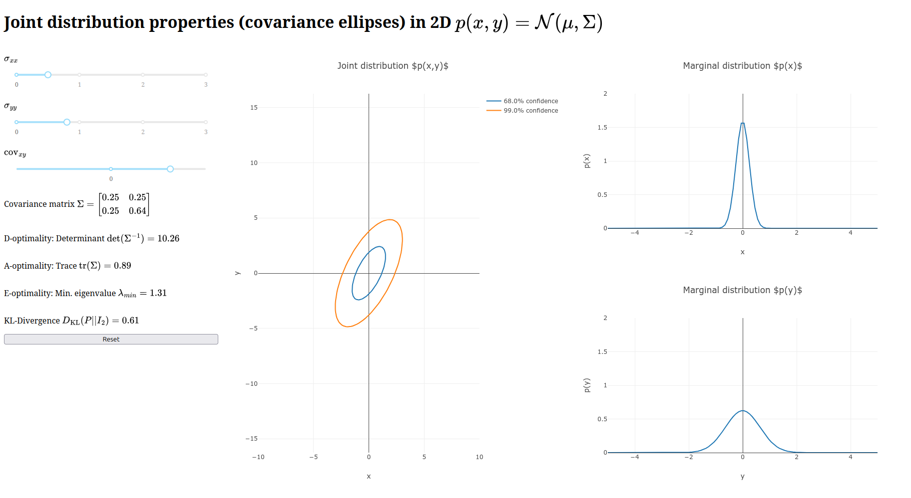

# python_scratch
Random collection of python stuff (mostly for plots)


### Linear regression demo
```
python linear_regression_demo.py
```
Check help with `-h` flag.


### Covariance plotly

Simple tool for interactively plotting 2D normal distributions and optimality statistics.
```bash
python covariance_plot.py
```

Navigate to [http://0.0.0.0:8050/](http://0.0.0.0:8050/) to see the interactive display. Should look like:


